# TP – Application Todo avec Spring Boot (Kotlin)

**Formation / TP – Spring Boot**  
**Public :** BTS SIO  
**Objectif :** Mettre en œuvre une application Web Spring Boot complète autour de la gestion de Todos, en utilisant Kotlin, Thymeleaf et Spring Security.

**Lien du Projet (starter) :https://github.com/Timomoulin/todo-starter**

**Lien du Projet (fin) : https://github.com/Timomoulin/Todo0**
## Sommaire

- [A. Création du contrôleur `UtilisateurTodoController`](#a-création-du-contrôleur-utilisateurtodocontroller)
    - [A.1 Création de la classe](#a1-création-de-la-classe)
    - [A.2 Annotation du contrôleur](#a2-annotation-du-contrôleur)
    - [A.3 Injection des DAO dans le contrôleur](#a3-injection-des-dao-dans-le-contrôleur)
    - [A.4 Création d’un mapping pour afficher les Todos](#a4-création-dun-mapping-pour-afficher-les-todos)
    - [A.5 Affichage d’une vue Thymeleaf](#a5-affichage-dune-vue-thymeleaf)
    - [A.6 Test fonctionnel](#a6-test-fonctionnel)
    - [A.7 Récupération des Todos depuis la base de données](#a7-récupération-des-todos-depuis-la-base-de-données)
    - [A.8 Mise à jour du template d’affichage](#a8-mise-à-jour-du-template-daffichage)
    - [A.9 Test fonctionnel](#a9-test-fonctionnel)

- [B. Affichage du formulaire de création d’un Todo](#b-affichage-du-formulaire-de-création-dun-todo)
    - [B.1 Injection de `CategorieDao`](#b1-injection-de-categoriedao)
    - [B.2 Création de la méthode `create`](#b2-création-de-la-méthode-create)
    - [B.3 Création du formulaire de création](#b3-création-du-formulaire-de-création)
    - [B.4 Test fonctionnel](#b4-test-fonctionnel)

- [C. Traitement du formulaire de création](#c-traitement-du-formulaire-de-création)
    - [C.1 Test fonctionnel](#c1-test-fonctionnel)
    - [C.2 Mise à jour de la méthode `store`](#c2-mise-à-jour-de-la-méthode-store)
    - [C.3 Affichage des erreurs de validation](#c3-affichage-des-erreurs-de-validation)
    - [C.4 Test fonctionnel](#c4-test-fonctionnel)

- [D. Sécurisation de l’application](#d-sécurisation-de-lapplication)
    - [D.1 Sécurisation des routes](#d1-sécurisation-des-routes)
        - [Solution 1 : Sécurisation globale via `filterChain()`](#solution-1--sécurisation-globale-via-filterchain)
        - [Solution 2 : Sécurisation spécifique via `@PreAuthorize`](#solution-2--sécurisation-spécifique-via-preauthorize)
    - [D.2 CSRF / XSRF](#d2-csrf--xsrf)
        - [Principe de protection contre le CSRF](#principe-de-protection-contre-le-csrf)
        - [Implémentation avec Spring Security](#implémentation-avec-spring-security)
    - [D.3 Logs](#d3-logs)

- [Conclusion](#conclusion)


## A. Création du contrôleur `UtilisateurTodoController`

### A.1 Création de la classe

- Faire un clic droit sur le package `controller`
- Sélectionner **New → Kotlin Class/File**


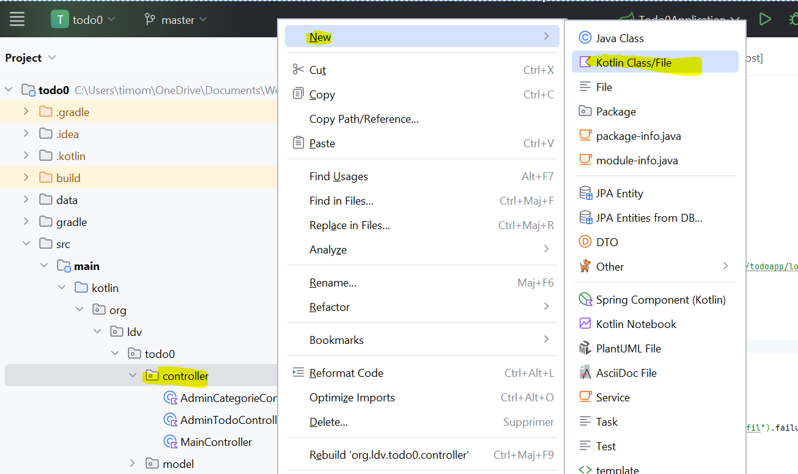

### A.2 Annotation du contrôleur

Annoter la classe afin qu’elle soit reconnue par Spring comme un contrôleur MVC.

```kotlin
@Controller
class UtilisateurTodoController {
}
```

> 💡 Il est recommandé d’utiliser l’auto‑complétion d’IntelliJ IDEA afin d’importer correctement l’annotation `@Controller`.


### A.3 Injection des DAO dans le contrôleur

Nous souhaitons injecter le `TodoDao` dans notre contrôleur afin d’accéder aux données.

L’injection se fait via le constructeur principal de la classe :

```kotlin
@Controller
class UtilisateurTodoController(
    private val todoDao: TodoDao
) {
}
```

> ℹ️ Le même principe s’applique pour l’injection dans une classe `@Service` ou `@Component`.


### A.4 Création d’un mapping pour afficher les Todos

Nous allons créer une méthode dans le contrôleur. Le nom de la méthode n’a pas d’importance ; ici, nous utilisons `index`.

Cette méthode doit répondre à une requête HTTP **GET**, nous utilisons donc l’annotation `@GetMapping`.

```kotlin
@GetMapping("/todoapp/utilisateur/todos")
fun index(): String {
    return "pagesUtilisateur/todos/index"
}
```

- `@GetMapping` précise la méthode HTTP utilisée
- L’argument correspond à l’endpoint exposé par l’application


### A.5. Affichage d’une vue Thymeleaf

#### Création du template

Créer le fichier suivant :

```
src/main/resources/templates/pagesUtilisateur/todos/index.html
```
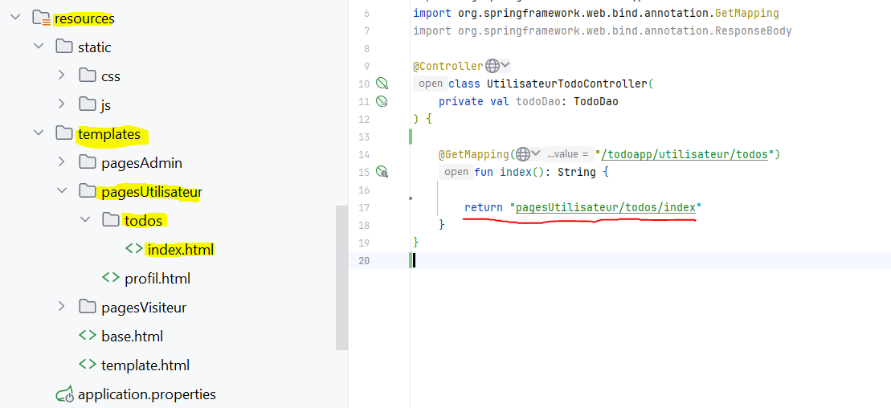

> ⚠️ Si la chaîne retournée par la méthode index() du controlleur n’est pas soulignée dans IntelliJ, cela indique que le chemin vers le template est incorrect.
> 
Faire un copier/coller de template.html  et ajouter un h1 pour obtenir :

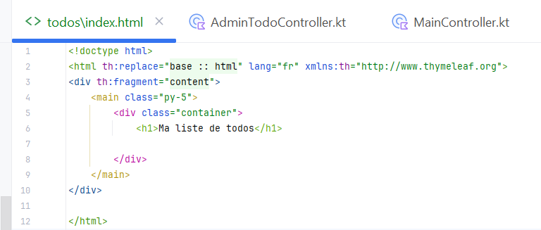


### A.6 Test fonctionnel

Démarrer l’application puis accéder à l’URL suivante :

```
http://localhost:8080/todoapp/utilisateur/todos
```

Vous devez voir s’afficher le titre **Ma liste de todos**.
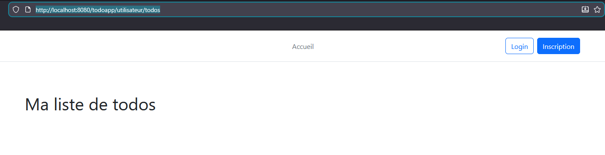


### A.7 Récupération des Todos depuis la base de données

Notre objectif est maintenant de récupérer les Todos enregistrés en base de données.

Après le `todoDao.` faite un CTRL + Espace pour voir les méthodes disponibles.

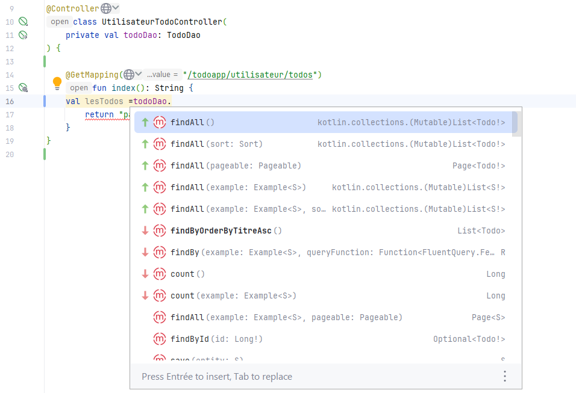

Nous allons pour cela utiliser le `TodoDao` et sa méthode `findAll()`.

```kotlin
@GetMapping("/todoapp/utilisateur/todos")
fun index(model: Model): String {
    val lesTodos = todoDao.findAll()
    model.addAttribute("todos", lesTodos)
    return "pagesUtilisateur/todos/index"
}
```

- Le paramètre `Model` permet de transmettre des données du contrôleur vers la vue.

Note : il existe plusieurs classes Model, la classe que l'on souhaite est : `org.springframework.ui.Model`

- La clé `todos` sera utilisée dans le template


### A.8. Mise à jour du template d’affichage

Nous utilisons Thymeleaf pour parcourir la liste des Todos et les afficher dynamiquement.

```html
<div class="container">
    <h1>Ma liste de todos</h1>
    <ul>
        <li th:each="unTodo : ${todos}"
            th:style="${'color :' + unTodo.categorie.couleur + ';'}">
            <h3 th:text="${unTodo.titre}"></h3>
            <p th:text="${'Description : ' + unTodo.description}"></p>
        </li>
    </ul>
</div>
```

- `th:each` permet de parcourir la collection
- Le style est déterminé par la couleur de la catégorie


### A.9. Test fonctionnel
Démarrer l’application puis accéder à l’URL suivante :

```
http://localhost:8080/todoapp/utilisateur/todos
```

Vous devez voir s’afficher les todos.


## B. Affichage du formulaire de création d’un Todo

### B.1 Injection de `CategorieDao`

Afin de récupérer les catégories depuis la base de données, nous injectons également le `CategorieDao`.

```kotlin
class UtilisateurTodoController(
    private val todoDao: TodoDao,
    private val categorieDao: CategorieDao
)
```


### B.2 Création de la méthode `create`


```kotlin
@GetMapping("/todoapp/utilisateur/todos/create")
fun create(model: Model): String {
    val lesCategories = categorieDao.findAll()
    val nouveauTodo = Todo(titre = "", description = "")

    model.addAttribute("categories", lesCategories)
    model.addAttribute("todo", nouveauTodo)

    return "pagesUtilisateur/todos/create"
}
```

> 💡 En plus des catégories, nous envoyons un objet Todo vierge au modèle. Cela permet à **Spring MVC** d’effectuer automatiquement le data binding, c’est-à-dire d’associer les champs du formulaire HTML aux propriétés de l’objet Todo.

>Ainsi, lors de la soumission du formulaire, Spring reconstruit automatiquement un objet Todo à partir des valeurs saisies par l’utilisateur. Nous récupérons donc directement un objet métier complet, sans avoir à lire ou traiter chaque champ du formulaire individuellement.

Note :
La convention utilisée pour les routes et les noms des templates dans le cadre des opérations de type CRUD est inspirée du framework Laravel (PHP).


### B.3 Création du formulaire de création

Créer le template suivant :

```
templates/pagesUtilisateur/todos/create.html
```
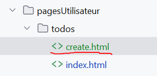

```html
<!doctype html>
<html th:replace="~{base :: html}" lang="fr" xmlns:th="http://www.thymeleaf.org">
<div th:fragment="content">
    <main class="py-5 container">

        <h1 class="mb-4">Créer un nouveau Todo</h1>

        <form th:action="@{/todoapp/utilisateur/todos}"
              th:object="${todo}"
              method="post">

            <div class="mb-3">
                <label for="titre" class="form-label">Titre *</label>
                <input type="text"
                       id="titre"
                       th:field="*{titre}"
                       class="form-control"
                       placeholder="Titre du todo"
                       required>
            <!--TODO Emplacement pour la validation du titre-->
            </div>

            <div class="mb-3">
                <label for="description" class="form-label">Description *</label>
                <textarea id="description"
                          th:field="*{description}"
                          class="form-control"
                          rows="4"
                          placeholder="Description du todo"
                          required></textarea>
            </div>
            <div class="mb-3">
                <label for="dateAFaire" class="form-label">A Faire Pour</label>
                <input id="dateAFaire"
                       th:field="*{dateAFaire}"
                       class="form-control"
                       type="datetime-local">
                </input>
            </div>
            <div class="mb-3">
                <div class="form-check form-switch">
                    <input th:field="*{etreFait}" class="form-check-input" type="checkbox" value="" id="checkNativeSwitch" switch>
                    <label class="form-check-label" for="checkNativeSwitch">
                        En cours/Fait
                    </label>
                </div>
            </div>
            <div class="mb-3">
                <label for="categorie">Categorie *</label>
                <select required th:field="*{categorie}" id="categorie" class="form-select">
                    <option selected disabled value="">Choisir une categorie</option>
                    <option th:each="uneCategorie : ${categories}"
                            th:value="${uneCategorie.id}"
                            th:text="${uneCategorie.nom}">
                    </option>
                </select>
            </div>

            <div class="mt-4">
                <button type="submit" class="btn btn-primary me-2">
                    Enregistrer
                </button>
                <a th:href="@{/todoapp/utilisateur/todos}" class="btn btn-secondary">
                    Annuler
                </a>
            </div>

        </form>

    </main>
</div>
</html>

```
#### Explications : 
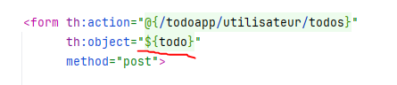
> La balise `<form>` indique, grâce à l’attribut `th:object`, que le formulaire est lié à l’objet `todo`.  
  Cela permet à **Thymeleaf et Spring MVC** de savoir que ce formulaire représente cet objet et facilite le **mapping automatique** des champs du formulaire vers les propriétés de l’objet.

  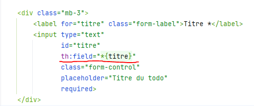

> Pour chaque champ du formulaire, l’attribut `th:field` permet de lier un champ HTML à une propriété de l’objet `Todo`.  
  `th:field` remplace automatiquement les attributs `name` et `value` du champ, ce qui garantit une correspondance correcte avec l’objet lors de la soumission du formulaire.

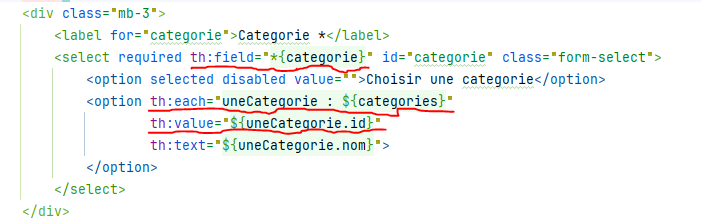

> Un champ un peu particulier est la **liste déroulante** permettant de choisir une catégorie.  
  L’attribut `th:field` fonctionne de la même manière que pour les autres champs. Nous utilisons ensuite un `th:each` pour parcourir la liste des catégories et générer dynamiquement les différentes options.  
  La valeur de chaque option correspond à l’`id` de la catégorie.


### B.4 Test fonctionnel

Faite un test dans votre navigateur pour vérifier que le formulaire fonctionne correctement.
``
http://localhost:8080/todoapp/utilisateur/todos/create
``

## C. Traitement du formulaire de création

Nous créons maintenant une méthode `store` afin de traiter l’envoi du formulaire.

#### PostMapping
Nous utilisons l’annotation ```@PostMapping``` car les données du formulaire sont transmises via la méthode HTTP POST.

#### Paramètres de la méthode
Nous allons ensuite ajouter un nouveau paramètre à la méthode, qui représente l’objet ``todo`` transmis par le formulaire.

Si vous souhaitez afficher un message flash après le traitement, vous pouvez également ajouter un second paramètre de type ``RedirectAttributes``.

#### Sauvegarde dans la BDD

Nous pouvons maintenant sauvegarder le todo dans la base de données en utilisant la méthode ``save()`` du ``todoDao``.

#### La dernière étape consiste à définir la valeur de retour de la méthode.

Pour cela, il suffit d’effectuer une redirection vers un autre endpoint à l’aide du mot-clé redirect:.

💡 Ce pattern est essentiel pour garantir une bonne expérience utilisateur et éviter les soumissions multiples de formulaires.

```kotlin
@PostMapping("/todoapp/utilisateur/todos")
fun store(todo: Todo): String {
    todoDao.save(todo)
    return "redirect:/todoapp/utilisateur/todos"
}
```

#### Note de sécurité sur @ModelAttribute :

Il est préférable de ne pas utiliser directement une classe entité (Todo) pour recevoir les données d’un formulaire.
Une bonne pratique consiste à utiliser une classe dédiée, par exemple TodoDTO (Data Transfer Object) ou TodoForm.

Dans ce cas précis, même dans des edge cases, aucune information sensible n’est exposée. Cependant, l’utilisation d’un TodoDTO, bien que plus lourde pédagogiquement, permet d’avoir plus de contrôle et constitue une meilleure pratique en conditions réelles.


### C.1 Test fonctionnel
Faite un test fonctionnel avec votre navigateur en envoyant le formulaire.
>Note : si le message flash ne s'affiche pas ajouter le code suivant dans le template index.html : 
```html
    <div th:if="${msg}" class="alert alert-success" th:text="${msg}"></div>
```


### C.2 Validation du formulaire

#### Validation Front-end
La validation front-end du formulaire peut se faire en utilisant les contraintes de validation HTML5. 
(Si besoin de validation plus complexe, on peut utiliser du JS en plus.)

 Par exemple, pour le champ du titre, on peut ajouter la contrainte `required`,`minlength` et `maxlength` :
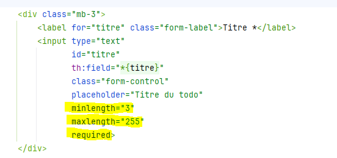


#### Ajout de la dépendance de validation

Dans le fichier `build.gradle.kts` vérifier que la dépendance suivante est présente :

```kotlin
implementation("org.springframework.boot:spring-boot-starter-validation")
```

Cette dépendance utilise des **annotations de validation** pour définir les contraintes sur les champs, ainsi que des **fonctionnalités Thymeleaf** pour afficher les messages d’erreur dans les vues.

#### Contraintes de validation dans l’entité `Todo`

Nous allons commencer par modifier la classe entité `Todo`  
(ou `TodoDTO` si vous utilisez un DTO).

Ajoutez les deux annotations suivantes **au-dessus de la propriété `titre`** :

```kotlin
@field:NotBlank(message = "Le titre est obligatoire")
@field:Size(min = 3, max = 255, message = "Le titre doit contenir entre 3 et 255 caractères")
var titre: String
```
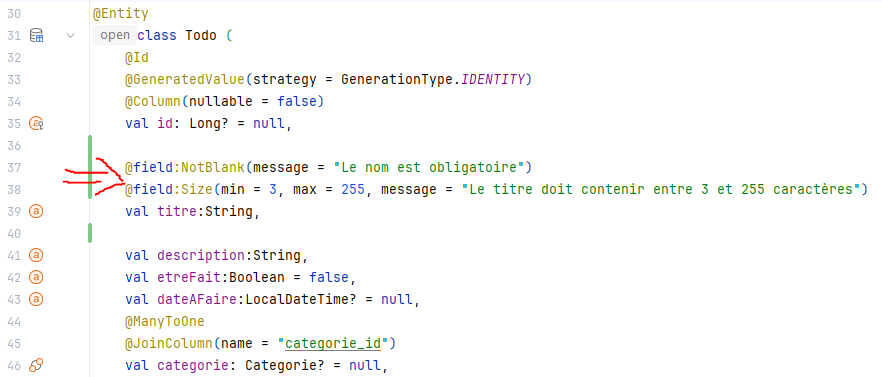


### C.3 Mise à jour de la méthode `store`
Nous retournons ensuite dans le contrôleur UtilisateurTodoController, au niveau de la méthode store :
```kotlin
@PostMapping("/todoapp/utilisateur/todos")
fun store(
    @ModelAttribute @Valid todo: Todo,
    bindingResult: BindingResult,
    model: Model,
    redirectAttributes: RedirectAttributes
): String {

    if (bindingResult.hasErrors()) {
        model.addAttribute("todo", todo)
        model.addAttribute("categories", categorieDao.findAll())
        return "pagesUtilisateur/todos/create"
    }

    todoDao.save(todo)

    redirectAttributes.addFlashAttribute(
        "msg",
        "Le Todo ${todo.titre} a bien été créé."
    )

    return "redirect:/todoapp/utilisateur/todos"
}
```
#### Explications :

- L’annotation @Valid permet d’activer les contraintes de validation définies sur l’objet Todo.

- Le paramètre BindingResult est obligatoire et doit être placé juste après l’objet validé.
Il permet de recenser les erreurs de validation détectées par Spring.

Si des erreurs sont présentes (bindingResult.hasErrors()), l’exécution normale de la méthode est interrompue :
- Les catégories sont renvoyées au modèle.
- Les messages d’erreur seront automatiquement affichés par Thymeleaf.
- Le formulaire est réaffiché.

Si aucune erreur n’est détectée :

- Le todo est sauvegardé en base de données.

- Un message flash est ajouté.

- Une redirection est effectuée vers la liste des todos (Post/Redirect/Get)


### C.4 Affichage des erreurs de validation

Sous le champ du titre, ajouter :

```html
<div class="text-danger"
     th:if="${#fields.hasErrors('titre')}"
     th:errors="*{titre}">
</div>
```


### C.5 Test fonctionnel

Afin de réaliser les tests, je vous recommande de procéder de l’une des manières suivantes :

- **Désactiver temporairement les contraintes de validation côté front-end** (HTML5).
- **Modifier les contraintes de validation via l’inspecteur du navigateur**.
- 
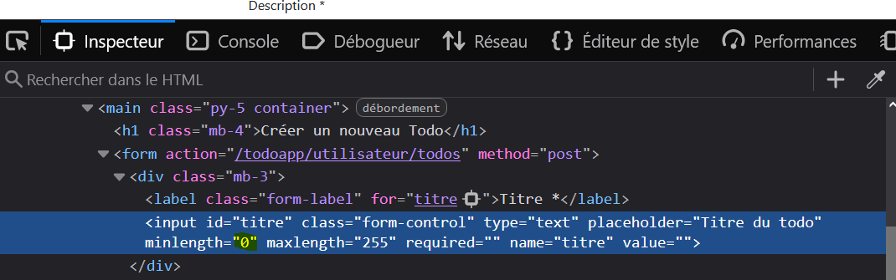

Ces manipulations permettent de tester correctement la **validation côté serveur** et de vérifier l’affichage des messages d’erreur gérés par Spring et Thymeleaf.

 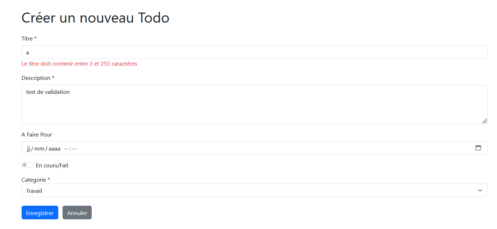

## D. Sécurisation de l’application

### D.1 Sécurisation des routes

Deux approches sont possibles :

- **Approche globale** via la méthode `chainFilter()` du `SecurityConfig`
- **Approche fine** via des annotations `@PreAuthorize` sur les méthodes des controllers.

#### Solution 1 : Sécurisation globale via `chainFilter()` de `SecurityConfig`

Cette approche consiste à sécuriser les routes directement dans la configuration de Spring Security, au niveau du `SecurityConfig`.

**Avantages :**
- Permet de sécuriser un grand nombre de routes/endpoints avec peu de code
- Centralise la configuration de sécurité

**Inconvénients :**
- Il est facile d’oublier de rendre certaines routes accessibles
- Moins adaptée si les règles d’accès ne peuvent pas être généralisées selon les endpoints


#### Solution 2 : Sécurisation spécifique via `@PreAuthorize`

Cette approche repose sur l’utilisation de l’annotation `@PreAuthorize` directement sur les méthodes des contrôleurs (`@GetMapping`, `@PostMapping`, etc.).

**Avantages :**
- Permet une **granularité fine** dans la gestion des droits
- Évite d’exposer le rôle de l’utilisateur dans l’URL (ex. `/admin/**`)
- Rend les règles de sécurité visibles directement au niveau du code métier

**Inconvénients :**
- Plus répétitif
- Nécessite malgré tout une configuration minimale dans le `SecurityConfig`
- Doit être activé avec l’annotation `@EnableMethodSecurity` dans le `SecurityConfig`


#### Combinaison des deux approches

Il est tout à fait possible (et recommandé) de **combiner les deux méthodes** :

- Utiliser la méthode `filterChain()` du `SecurityConfig` pour gérer la majorité des cas
- Gérer les exceptions ou règles spécifiques à l’aide de `@PreAuthorize`


### Mise en œuvre
### Solution 1 : Via la méthode filterChain() du `SecurityConfig`

1. Supprimer l’endpoint suivant de la liste des routes publiques :
2. Décommenter la règle indiquant que toutes les routes commençant par :

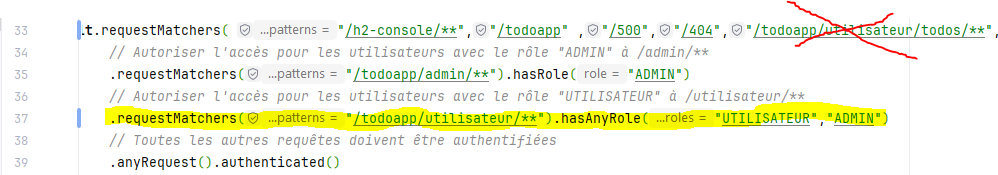

### Solution 2 : Via `@PreAuthorize`

Dans la classe `UtilisateurTodoController`, ajouter l’annotation suivante **avant chaque méthode** annotée avec `@GetMapping` ou `@PostMapping` :

```kotlin
@PreAuthorize("hasAnyRole('UTILISATEUR','ADMIN')")
```
> Cette annotation garantit que seules les personnes disposant des rôles appropriés peuvent accéder aux fonctionnalités concernées.

### Test fonctionnel

Nous vous invitons à effectuer un test fonctionnel.

Si vous essayez d’accéder à une route que vous avez sécurisée, vous devriez être automatiquement redirigé vers le **formulaire de connexion**, sauf si vous êtes déjà authentifié.

### D.2 CSRF / XSRF

Le **Cross-Site Request Forgery (CSRF ou XSRF)** est une faille de sécurité qui consiste à faire exécuter, à l’insu d’un utilisateur authentifié (par exemple un administrateur), une requête HTTP malveillante.

Cette requête peut être dissimulée dans :
- un e-mail,
- un message,
- ou un site web...

Si l’utilisateur est connecté à l’application, la requête peut être exécutée avec ses droits.


## Principe de protection contre le CSRF

La protection contre le CSRF repose sur l’utilisation d’un **token unique** :

- Un token est généré et stocké dans la **session de l’utilisateur** (ou en cookie)
- Ce token est également intégré dans le formulaire sous la forme d’un **champ caché**
- Lors de la soumission du formulaire :
    - si le token transmis correspond à celui stocké en session, la requête est acceptée
    - sinon, la requête est rejetée

👉 Si la requête est légitime (l’utilisateur a bien accédé au formulaire), les deux tokens correspondent.  
👉 Si la requête est forgée par un attaquant, le token sera absent ou incorrect, et la requête sera bloquée.


### Implémentation avec Spring Security

Spring Security **active la protection CSRF par défaut**.

Dans un but pédagogique, cette protection a été temporairement désactivée.

Pour la réactiver, il suffit de **commenter la ligne (30) suivante dans le `SecurityConfig`** :

```kotlin
 .csrf { it.disable() }
```

#### Ajout du token CSRF dans les formulaires

Lorsque la protection CSRF est activée, toutes les requêtes HTTP de type :
- POST
- PUT
- PATCH
- DELETE

doivent obligatoirement inclure le token CSRF.

Dans les templates Thymeleaf, ajoutez le champ caché suivant dans tous les formulaires :
```html
<input type="hidden"
       th:name="${_csrf.parameterName}"
       th:value="${_csrf.token}">
```
### Test fonctionnel
Faite un test fonctionnel avec votre navigateur en envoyant le formulaire de login et le formulaire de création d'un Todo.

### D.3 Logs
L'application comporte des logs (dans le dossier logs a la racine du projet). 
#### Le log technique :
- Produit par les développeurs et les composants internes (Spring, Hibernate, etc.).
- Sert à comprendre le fonctionnement technique de l’application.
- Utilisé pour : diagnostiquer un bug; analyser une erreur; suivre un flux d’exécution.

Contenu typique :
message d’erreur; stacktrace; événement système; information d’exécution.

#### Le log d'audit : 
- Produit pour tracer les actions des utilisateurs.
- Sert à garantir la traçabilité, la responsabilité et la sécurité.
Utilisé pour :
- Prouver qu’un utilisateur a réalisé une action,
- Détecter un usage frauduleux,
- Répondre à des obligations légales (RGPD, conformité).

Contenu typique :
Utilisateur; action; date/heure; IP; ressource concernée.

#### Mise en place des logs  pour le UtilisateurTodoController:
#### Etape 1 : Ajouter les logs comme propriété du controleur : 
````kotlin
private val logger = LoggerFactory.getLogger(UtilisateurTodoController::class.java)
private val auditLogger = LoggerFactory.getLogger("AUDIT")
private val dateFormatter = DateTimeFormatter.ofPattern("yyyy-MM-dd HH:mm:ss")
````
> **logger** → logs classiques (info, debug, warn)

> **auditLogger** → logs sensibles pour audit.log

> **dateFormatter** → pour afficher l’heure de l’action dans l’audit
#### Étape 2 : Créer une fonction utilitaire pour récupérer nom utilisateur et IP
Vous pouvez pour l'instant définir cette méthode directement dans le controleur. 
Même s'il est préferable de la factoriser dans une classe utilitaire de service. 
La fonction doit retourner un couple (username, ip)
````kotlin
private fun getCurrentUserInfo(): Pair<String, String> {
    val username = org.springframework.security.core.context.SecurityContextHolder
        .getContext().authentication?.name ?: "ANONYME"

    val request = (RequestContextHolder.getRequestAttributes() as? ServletRequestAttributes)?.request
    val ip = request?.remoteAddr ?: "IP inconnue"

    return username to ip
}
````
#### Etape 3 :  Ajouter des logs à la méthode index()
Modifications : ajout du log info pour savoir qui a consulté la page et depuis quelle IP.

Pas de log audit ici, car ce n’est pas une action sensible (lecture seule).
````kotlin
@PreAuthorize("hasAnyRole('UTILISATEUR','ADMIN')")
@GetMapping("/todoapp/utilisateur/todos")
fun index(model: Model): String {
    val (username, ip) = getCurrentUserInfo()
    
    logger.info("Utilisateur $username depuis IP $ip accède à la liste des todos")
    
    val lesTodos = todoDao.findAll()
    model.addAttribute("todos", lesTodos)
    return "pagesUtilisateur/todos/index"
}
````
#### Étape 4 : Ajouter des logs à la méthode create()
Pour savoir qui a ouvert le formulaire de création, utile pour audit indirect ou debug.
````kotlin
@GetMapping("/todoapp/utilisateur/todos/create")
fun create(model: Model): String {
    val (username, ip) = getCurrentUserInfo()
    logger.info("Utilisateur $username depuis IP $ip accède au formulaire de création d'un Todo")
    
    val lesCategories = categorieDao.findAll()
    val nouveauTodo = Todo(titre = "", description = "")
    model.addAttribute("categories", lesCategories)
    model.addAttribute("todo", nouveauTodo)
    return "pagesUtilisateur/todos/create"
}
````
#### Étape 5 : Ajouter des logs à la méthode store() 
Les échecs de validation sont loggés en warn pour debug

La création réussie est loggée dans audit.log avec nom utilisateur, IP et date.
````kotlin
@PostMapping("/todoapp/utilisateur/todos")
fun store(
    @ModelAttribute @Valid todo: Todo,
    bindingResult: BindingResult,
    model: Model,
    redirectAttributes: RedirectAttributes
): String {

    val (username, ip) = getCurrentUserInfo()

    if (bindingResult.hasErrors()) {
        logger.warn("Échec de création du Todo par $username depuis IP $ip : erreurs de validation")
        model.addAttribute("todo", todo)
        model.addAttribute("categories", categorieDao.findAll())
        return "pagesUtilisateur/todos/create"
    }

    val nouveauTodo = todoDao.save(todo)
    
    // Log audit pour action sensible
    auditLogger.info("[${LocalDateTime.now().format(dateFormatter)}] Utilisateur $username depuis IP $ip a créé le Todo '${nouveauTodo.titre}' (id=${nouveauTodo.id})")
    
    redirectAttributes.addFlashAttribute(
        "msg",
        "Le Todo ${todo.titre} a bien été créé."
    )
    return "redirect:/todoapp/utilisateur/todos"
}
````
## Conclusion

Ce TP permet de mettre en pratique :
- L’architecture MVC avec Spring Boot
- L’utilisation de Kotlin dans un contexte professionnel
- La gestion de formulaires et de la validation back‑end
- Les bases de la sécurisation d’une application Web


**Merci de votre attention !**

